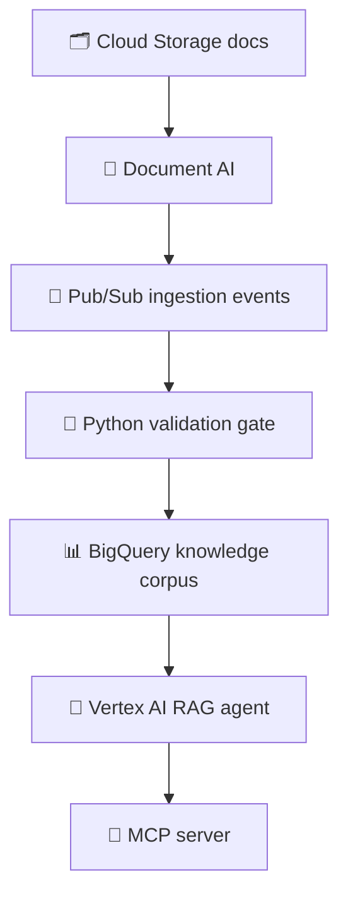
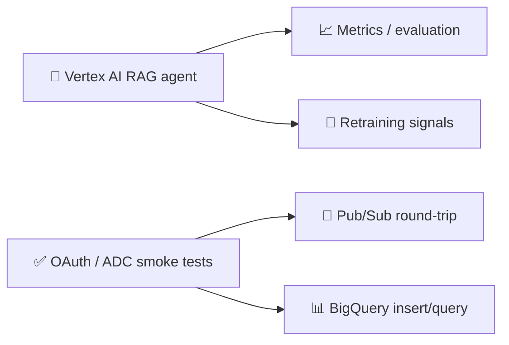

# Architecture diagram notes

Use this page as the linked source for the presentation diagram.

## Main flow

## Feedback loop

## How the process works

1. Docs are ingested from Cloud Storage.
2. Document AI extracts usable text.
3. Pub/Sub transports ingestion events.
4. The Python gate rejects invalid payloads before publish.
5. BigQuery becomes the knowledge base.
6. Vertex AI uses the corpus to answer questions.
7. The MCP server exposes the capability to tools and agents.
8. Smoke tests prove the full path against real infrastructure.
