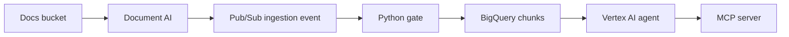
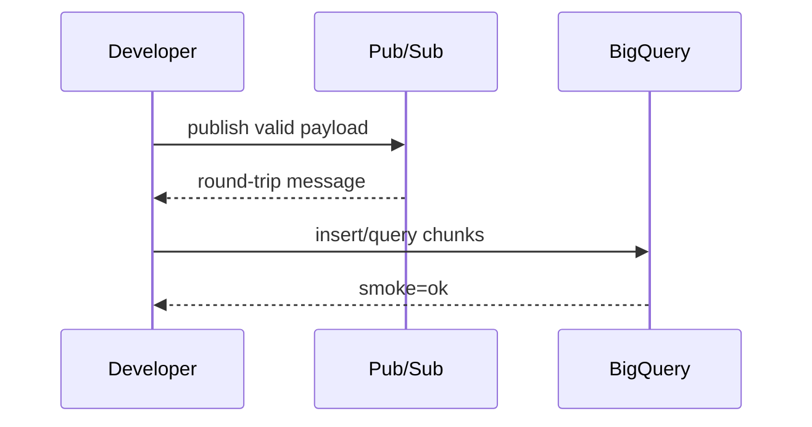

# Architecture diagrams

## End-to-end flow

```mermaid
flowchart LR
  A[Docs bucket] --> B[Document AI]
  B --> C[Pub/Sub ingestion event]
  C --> D[Python gate]
  D --> E[BigQuery chunks]
  E --> F[Vertex AI agent]
  F --> G[MCP server]
```

## Smoke test flow

```mermaid
sequenceDiagram
  participant Dev as Developer
  participant PubSub as Pub/Sub
  participant BQ as BigQuery
  Dev->>PubSub: publish valid payload
  PubSub-->>Dev: round-trip message
  Dev->>BQ: insert/query chunks
  BQ-->>Dev: smoke=ok
```
